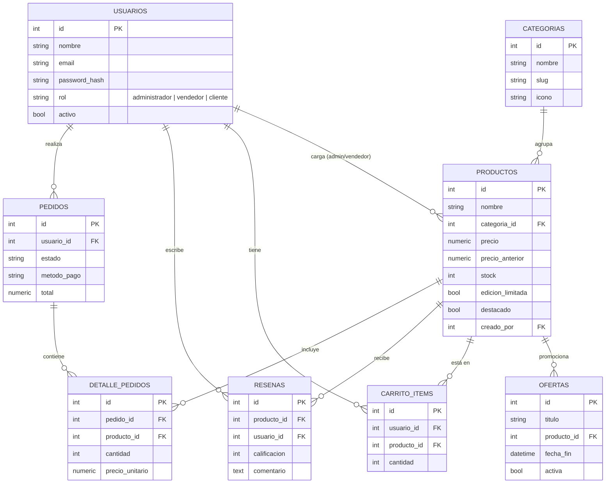

# Diagrama entidad-relación — Chicos Wheels

```mermaid
erDiagram
    USUARIOS ||--o{ PEDIDOS : realiza
    USUARIOS ||--o{ RESENAS : escribe
    USUARIOS ||--o{ CARRITO_ITEMS : tiene
    USUARIOS ||--o{ PRODUCTOS : "carga (admin/vendedor)"

    CATEGORIAS ||--o{ PRODUCTOS : agrupa

    PRODUCTOS ||--o{ DETALLE_PEDIDOS : incluye
    PRODUCTOS ||--o{ RESENAS : recibe
    PRODUCTOS ||--o{ CARRITO_ITEMS : "está en"
    PRODUCTOS ||--o{ OFERTAS : promociona

    PEDIDOS ||--o{ DETALLE_PEDIDOS : contiene

    USUARIOS {
        int id PK
        string nombre
        string email
        string password_hash
        string rol "administrador | vendedor | cliente"
        bool activo
    }

    CATEGORIAS {
        int id PK
        string nombre
        string slug
        string icono
    }

    PRODUCTOS {
        int id PK
        string nombre
        int categoria_id FK
        numeric precio
        numeric precio_anterior
        int stock
        bool edicion_limitada
        bool destacado
        int creado_por FK
    }

    OFERTAS {
        int id PK
        string titulo
        int producto_id FK
        datetime fecha_fin
        bool activa
    }

    PEDIDOS {
        int id PK
        int usuario_id FK
        string estado
        string metodo_pago
        numeric total
    }

    DETALLE_PEDIDOS {
        int id PK
        int pedido_id FK
        int producto_id FK
        int cantidad
        numeric precio_unitario
    }

    RESENAS {
        int id PK
        int producto_id FK
        int usuario_id FK
        int calificacion
        text comentario
    }

    CARRITO_ITEMS {
        int id PK
        int usuario_id FK
        int producto_id FK
        int cantidad
    }
```
